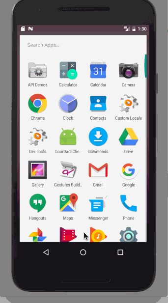

# DoorDash Demo : A simple application exercising some of DoorDash APIs 
A simple application that searches restaurants near the user's current location and adds restaurants to favorites

## User Stories

The following **required** functionality is completed:

* [x] View all restaurants near a given location
* [x] Add restaurants to a favorite list

The following **optional** features are implemented:

* [x] Display search results in a map

To setup: Please copy your Google Maps API key to google_maps_api.xml before compiling this app

Walkthrough of all user stories:

GIF created with [LiceCap](http://www.cockos.com/licecap/).
